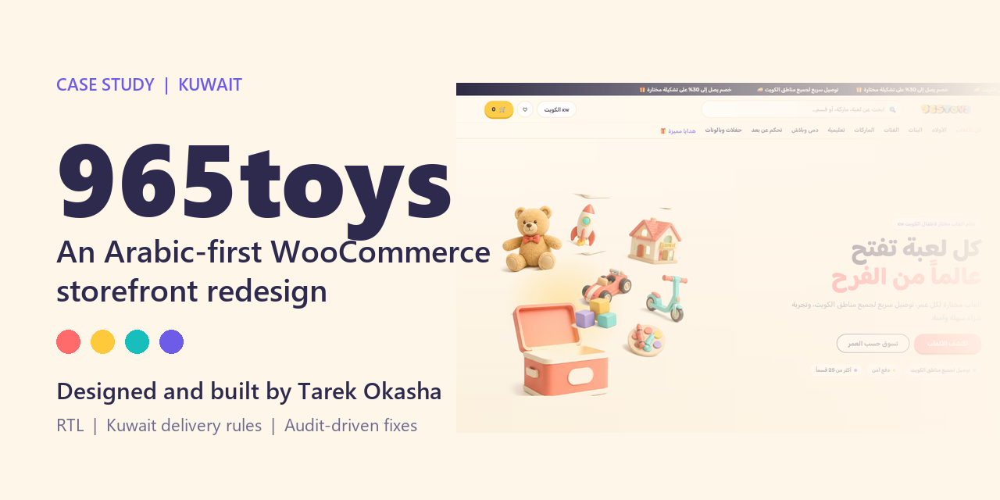
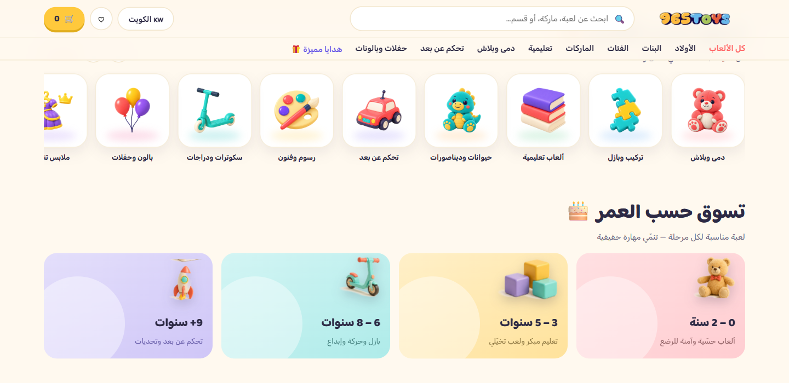
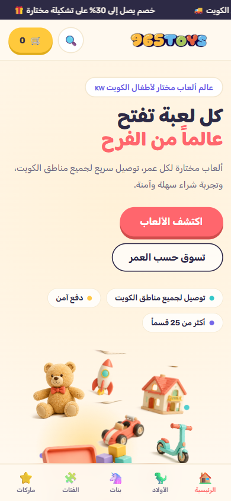

# 965toys

**An Arabic-first WooCommerce child theme for Woodmart, built for a toy store in Kuwait.** 
Designed and built by [Tarek Okasha](https://github.com/tarekokashha).

[**Live store**](https://965toys.com) · [العربية](README.ar.md) · [Documentation](docs/) · [Portfolio](https://tarek-portfolio-phi.vercel.app)

---

> **Status.** The redesign is built. [965toys.com](https://965toys.com) currently shows a coming-soon page while the store prepares to launch, so the screenshots below are of the **design prototype this theme implements**, not of a live deployment.

## The project

965toys is a toy store for Kuwait. I designed and built its redesign as a **WooCommerce child theme for Woodmart**: an Arabic-first, right-to-left storefront with a playful motion layer, a shelf-based homepage, delivery rules written for Kuwait, share cards that render properly in WhatsApp, and a set of performance and accessibility fixes that came out of auditing the live store first.

It is one of three stores in the 965 collection, alongside [965gym](https://github.com/tarekokashha/965gym-storefront) and [965play](https://github.com/tarekokashha/965play-storefront).

## At a glance

| | |
|---|---|
| **Role** | Design direction, theme engineering, store audit, tooling: [Tarek Okasha](https://github.com/tarekokashha) |
| **Client** | 965toys, Kuwait |
| **Stack** | WordPress, WooCommerce, the Woodmart parent theme, PHP, vanilla JavaScript |
| **Language** | Arabic first, right to left |
| **Shape** | Thirteen independent modules. The design is a switch, off by default, with an administrator-only preview |
| **Live** | [965toys.com](https://965toys.com), currently a coming-soon page while the store prepares to launch |
| **Status** | Built |

## Screens

| Shop by category and age | Mobile |
|---|---|
|  |  |

## What I built

### A launch you can reverse
Activating the theme changes nothing. The whole redesign sits behind one switch that defaults to **off**, with an administrator-only preview (`?toybox=1`), so launching is a single reversible action and the store is never half-redesigned. → [Architecture](docs/architecture.md)

### Delivery rules for Kuwait
Kuwait's remote areas are not WooCommerce states, and several sit inside the same governorate as ordinary areas, so a shipping zone cannot tell them apart. I match them from the address text, after Arabic normalisation, with the longest match winning. Express delivery disappears after 19:00 and is never offered to a remote area, and I fixed a WooCommerce caching problem that would have kept offering it after the cut-off. → [Delivery rules](docs/delivery.md)

### Fixes that came from measuring the store first
The live store's largest paint waited on a JavaScript download because the logo was lazy-loaded. Its viewport tag blocked pinch-zoom. All 216 product images had empty alt text. It emitted no Open Graph tags, so every shared link was a grey URL. A price-entry bug made 43 of 193 products unsellable. Each finding has a fix in code, and the price bug has an audit tool. → [The audit and its fixes](docs/audit-and-fixes.md)

### WhatsApp as a first-class channel
Share cards sized for WhatsApp's limits (dimensions present, under 300 KB, cache-busted when the image changes), and an "order via WhatsApp" button on every product page with the product name, SKU and link pre-filled. → [Decisions](docs/decisions.md)

### A motion layer that respects the visitor
A five-second "Wonder Box" opening scene, balloons, reveals, parallax, tilt and an add-to-cart celebration: vanilla JavaScript, animating only `transform` and `opacity`, fully gated on reduced motion. → [Motion](docs/motion.md)

### A catalogue-aware homepage
Twelve collection shelves resolved to real categories, a brand rail, age cards and clay category icons. A shelf, brand or category with no products is never rendered, and images are resolved by filename so nothing depends on attachment IDs.

## About the source code

This repository documents the work. **The source code, the full site and its data are private and are not published here.** What is here is the design, the engineering decisions, the measurements and the screenshots.

## License and credit

- **Documentation** is [CC BY 4.0](LICENSE). Reuse must credit **Tarek Okasha** and link to this repository.
- 965toys's name, logo and imagery are **not** licensed here. See [NOTICE](NOTICE.md).

Copyright (c) 2026 Tarek Okasha.

## About the author

I am **Tarek Okasha**, a robotics and automation engineer in Cairo who builds systems that run without supervision: six-axis robots, AI automations, and the custom software and brand presences that companies actually operate on. More of my work is in my [portfolio](https://tarek-portfolio-phi.vercel.app) and on [GitHub](https://github.com/tarekokashha).
