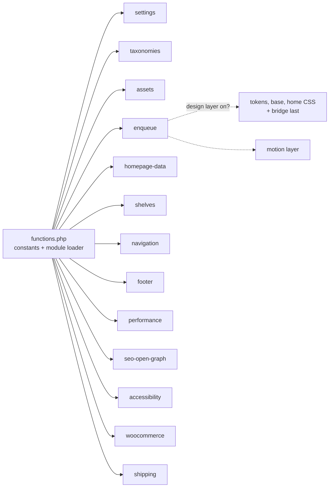

# Architecture

How the 965toys child theme is organised. Designed and built by [Tarek Okasha](https://github.com/tarekokashha).

The theme is a **WooCommerce child theme for Woodmart**. Everything the redesign changes lives in the child, so updating the parent can never destroy the work. It is organised as thirteen small modules that each do one job and can each be switched off independently.

## The shape of it



`functions.php` defines the version and path constants, the store identity constants, and a tolerant loader:

```php
function toys965_module( $name ) {
    $path = TOYS965_DIR . '/inc/' . $name . '.php';
    if ( is_readable( $path ) ) {
        require_once $path;
    }
}
```

A missing module is skipped, not fatal. **A storefront should degrade, not white-screen.**

## The modules

| Module | What it does |
|---|---|
| `settings` | Theme options registered through the Settings API (also exposed to REST) and surfaced in the Customizer, so the owner changes them without touching code |
| `taxonomies` | Three product axes the store did not have: `pa_gender`, `pa_age` and `pa_brand`, registered as global WooCommerce attributes so they get real archives, layered-nav widgets and normal editing. Empty brands are never rendered; the terms exist so a card appears the moment stock is tagged |
| `assets` | A media resolver that finds the design's images **by filename** at runtime and caches the result, instead of hard-coding attachment IDs that differ between environments |
| `enqueue` | Stylesheet and script loading, the design-layer switch, template registration, and removal of Google Fonts once the self-hosted faces are serving |
| `homepage-data` | Every homepage query and the product-card renderer, cached because the homepage is the most requested page |
| `shelves` | The twelve collection shelves and the brand rail. A shelf with no products is never rendered |
| `navigation` | The mobile bottom navigation (up to 768 px), the gender archive hero bands and the empty-cart state |
| `footer` | The design footer, rendered sitewide on `wp_footer` |
| `performance` | The LCP, lazy-load and dead-weight fixes. See [audit-and-fixes.md](audit-and-fixes.md) |
| `seo-open-graph` | Open Graph and Twitter tags, so shared links render as rich cards in WhatsApp and Instagram |
| `accessibility` | Viewport zoom, alt text, a skip link, and language marking for mixed-script titles |
| `woocommerce` | Presentation and ordering affordances: price-entry guard, age badge, "order via WhatsApp", free-delivery progress, sale percentage, trust strip |
| `shipping` | Kuwait delivery rules. See [delivery.md](delivery.md) |

## The design layer is a switch

Activating the theme **does not change the storefront's appearance**. The new typography, colour system, components and motion sit behind one switch, `toys965_design_enabled()`, which defaults to **off**:

1. An **administrator-only, per-request preview**: add `?toybox=1` to any URL while logged in as an administrator to see the new design, `?toybox=0` to hide it. It requires the `manage_options` capability, so a visitor cannot trigger it.
2. A `TOYS965_DESIGN` constant in `wp-config.php`, for environments where the switch should be fixed.
3. The `toys965_design` option, shown as a checkbox in the Customizer.

Modules that only make sense with the new design (the footer, the mobile navigation, the font preloads, the delivery table) all check the same function, so the store is either entirely the old design or entirely the new one. That is what makes a launch a single reversible action.

## Load order

The order is deliberate, and is documented in `inc/enqueue.php`:

1. The Woodmart parent stylesheet, the WooCommerce template layer.
2. `fonts.css`: the `@font-face` rules, which must precede anything that uses them.
3. The design tokens.
4. The base layer: reset and Arabic and RTL corrections.
5. The homepage sections and shared components.
6. **`woodmart-bridge.css`, last.** It maps the design's tokens onto Woodmart's own `--wd-*` variables. Woodmart prints its variable block inline in `<head>` after the enqueued styles, so only a stylesheet that arrives last actually makes the *whole store* adopt the design, not just the homepage template.

On the cart, checkout and account pages (the commerce path) the theme changes as little as it can. Breaking checkout to save a few kilobytes is never a good trade.

## The media resolver

The design ships 56 images (sprites, clay category icons, shelf banners, feature art). Rather than hard-code attachment IDs, which differ between environments and break the moment anything is re-uploaded, `assets.php` resolves each by filename and caches the answer. The cache is busted whenever an attachment is added or removed.

One subtlety it handles: the desktop and mobile versions of a banner share a filename, so WordPress suffixes the second upload with `-1`. The resolver tells them apart by **aspect ratio, never by the suffix**, because the suffix depends on upload order.

## Caching

Shelf, brand and term queries are cached, and flushed on `woocommerce_update_product` and `woocommerce_new_product`, so the homepage reflects stock changes without a stampede of queries on every request.

## The footer, and why it works the way it does

Woodmart's footer is an Elementor template painted into the parent's footer area. It cannot be unhooked. Two earlier approaches were wrong: rendering a second footer beside it produced two `<footer>` landmarks, and buffering `get_footer()` output to swap the element blanked the whole page, because an output-buffer callback that fails emits **nothing**.

What runs now: render the design footer on `wp_footer` and hide Woodmart's with `display:none`. Nothing is buffered, so the page cannot blank, and a `display:none` element is dropped from the accessibility tree, so screen readers still see exactly one `contentinfo` landmark. The original footer is hidden, never deleted, so removing one CSS rule restores it instantly. The history is recorded in the file's header so nobody tries the buffering approach again.

## Configuration

Contact details are constants, so the code can be public while the store's numbers stay in its own `wp-config.php`:

```php
define( 'TOYS965_WHATSAPP',  '965XXXXXXXX' );
define( 'TOYS965_EMAIL',     'hello@your-store.example' );
define( 'TOYS965_INSTAGRAM', 'https://www.instagram.com/your-handle' );
define( 'TOYS965_TIKTOK',    'https://www.tiktok.com/@your-handle' );
```

## Repository map

| Path | What it is |
|---|---|
| `965toys-child/` | The WordPress child theme |
| `965toys-child/inc/` | The thirteen modules |
| `965toys-child/page-templates/` | Homepage, categories and brands templates |
| `965toys-child/assets/` | Stylesheets, the motion layer, and the self-hosted fonts |
| `tools/audit_prices.py` | A read-only price-integrity audit for any WooCommerce store |
| `docs/` | This documentation |
