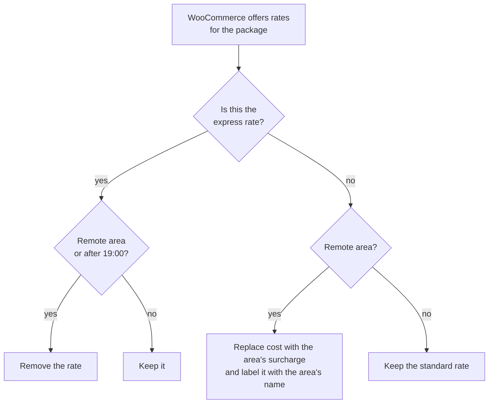

# Delivery rules for Kuwait

How the store prices and offers delivery, and the three problems that WooCommerce cannot solve on its own. Engineering by [Tarek Okasha](https://github.com/tarekokashha); the code is `965toys-child/inc/shipping.php`.

## The design

The three delivery speeds are **native WooCommerce flat rates** in the Kuwait zone, so the store owner edits their prices in wp-admin without touching code:

| Speed | Default price |
|---|---|
| Next-day delivery | 1.000 KWD |
| Same-day delivery | 1.800 KWD |
| Express, 90 to 180 minutes | 2.500 KWD |

`shipping.php` adds the two rules that WooCommerce cannot express, and fixes a caching problem that would otherwise make one of them wrong.



## Problem 1: remote areas are not WooCommerce "states"

Kuwait's remote areas do not map to WooCommerce states. Three of them sit **inside the same governorate as ordinary areas**, so a shipping zone cannot separate them. They have to be recognised from the address text.

`toys965_remote_areas()` holds the price list. Each entry has a name, a flat cost and a list of **match needles**:

```php
array(
    'name'  => 'المطلاع',
    'cost'  => 5.000,
    'match' => array( 'المطلاع', 'مطلاع' ),
),
```

How the match works, and why each detail is there:

- **Arabic normalisation.** Needles and the address are both passed through `toys965_normalise_ar()` before comparing. It strips tatweel and diacritics, folds the alef variants (آ أ إ) into a plain alef, unifies ta marbuta with ha and alef maqsura with ya, and removes whitespace, so "الاحمد" and "الأحمد" are the same word and spacing differences cannot defeat a match.
- **The whole address is searched**: city, both address lines and state. It fires whether the customer typed the area into the city field, the address line, or both.
- **Longest needle wins.** "صباح الأحمد البحرية" and "مدينة صباح الأحمد السكنية" both contain "صباح الأحمد". Hits are collected by needle length and the longest wins, so the marine city (7.000 KWD) is never mistaken for the residential city (5.000 KWD).

A remote-area order pays the area's flat surcharge **instead of** the standard rate, with the area's name appended to the rate label so the customer sees why. The surcharge is tax-free in the rate.

## Problem 2: express disappears after 19:00, and never goes to a remote area

Express delivery takes 90 to 180 minutes, so it is only offered for orders placed before **19:00 local time**. The cut-off hour is filterable (`toys965_express_cutoff_hour`), and it uses the **site's configured timezone**, not the server's, through `wp_date()`.

The express rate is recognised by its label, not by its internal ID, and removed when either condition holds: the address is in a remote area, or the window has closed.

## Problem 3: WooCommerce caches rates, and the cache does not know the time

WooCommerce caches the shipping rates it calculates against a **hash of the package**. The hash covers the address and the cart, but it knows nothing about the clock. Without a fix, a session that loaded the cart at 18:55 would still be offered express at 19:30.

`toys965_shipping_cache_key()` adds the express window state (`open` or `closed`) to the package, so the hash changes at the cut-off and the rates are recalculated. It is one small filter, and it is the difference between a rule that works in a demo and one that works at 19:01.

## What the shopper sees

A shopper abandons at the payment step most often because of a delivery fee they did not see coming, so the cost is shown **before** checkout:

- **On the cart:** a table of the three speeds and the remote-area surcharges, with the express row greyed and a note when the window has closed. Remote areas carry a note that express is not available to them.
- **On the product page:** a one-line hint under the add-to-cart button: next day, same day, and whether express is still open.
- **Anywhere:** the `[toys965_delivery]` shortcode renders the same table on any page.

The table and the hint only appear when the design layer is on.

## What this code does not touch

It never touches the payment step. The gateway is untouched, and nothing here changes product prices, the cart object or the checkout submission path. The rules only decide which delivery rates are offered and what a remote-area rate costs.

## Changing the numbers

| To change | Where |
|---|---|
| The price of a delivery speed | WooCommerce, Shipping zones, in wp-admin |
| Remote areas, their names and surcharges | `toys965_remote_areas()` in `inc/shipping.php` |
| The express cut-off hour | The `toys965_express_cutoff_hour` filter (default 19) |
| The wording on the cart | `toys965_delivery_table()` |

The remote-area prices are defaults that match the store's published rates. Treat them as configuration for your own store.
