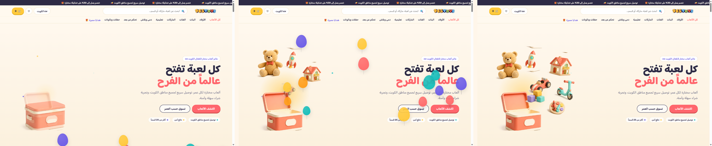

# The motion layer

A playful, dependency-free motion layer for the storefront: a five-second "Wonder Box" opening scene, balloons, scroll reveals, parallax, tilt and an add-to-cart celebration. Designed and built by [Tarek Okasha](https://github.com/tarekokashha).

*Left to right: 0.8 s, 2.2 s and the settled hero. Captured from the design prototype this theme implements.*

## Principles

- **Vanilla JavaScript, no dependencies, deferred.** The whole layer is one file.
- **It animates only `transform` and `opacity`.** Those are the two properties the browser can animate on the compositor without layout or paint, so the motion stays smooth on a mid-range phone.
- **It respects the visitor.** Everything is gated on `prefers-reduced-motion`, and the hover tilt is gated on a fine pointer, so touch devices never run it.
- **It is time-driven or event-driven, never a scroll jack.** Nothing captures the scroll position to move the page.

## The six pieces

| # | Piece | What it does |
|---|---|---|
| 1 | **Wonder Box** | The signature scene: a toy box opens and a teddy bear, rocket, house, car, scooter, blocks and a paint palette fly out of it into their resting places in the hero. **Five seconds**, driven by time, not scroll |
| 2 | **Balloons** | An intro flight on the homepage (14 balloons) and a shorter celebration on add-to-cart (8 balloons) that cannot stack on top of itself |
| 3 | **Reveals** | `IntersectionObserver`-driven fade and rise as sections enter, with a force-reveal fallback |
| 4 | **Parallax** | A gentle shift on shelf banners, throttled to one update per animation frame |
| 5 | **Tilt** | A tilt of up to 8 degrees on product cards, for fine pointers only |
| 6 | **Confetti** | Eighteen pieces in the store's five colours on WooCommerce's real `added_to_cart` event |

### The Wonder Box scene

`wbApply( p )` renders the scene at progress `p` from 0 to 1, and a `requestAnimationFrame` loop feeds it `min( 1, seconds / 5 )`. It was ported directly from the design prototype so the timing curve is identical:

- The lid crossfades from closed to open over progress 0.12 to 0.28.
- Each toy starts at 0.18 plus its own stagger and runs over its own duration, with an ease-out-cubic curve, travelling **from the box's mouth to its final slot**.
- Scale runs from 0.3 to 1 and rotation from minus 22 degrees to the toy's resting tilt.

Details that matter:

- **It waits for its markup.** On a slow first paint the scene may not be in the DOM yet, so the loop waits (up to about ten seconds of frames) before starting.
- **A clean hand-off.** When the five seconds end, the toys are handed over to their CSS float loops *without a jump*. The inline transform is what the float animation would otherwise fight, so it is cleared at that moment.
- **It runs first.** `wbStart()` is the first call at boot, because the scene is the hero and therefore adjacent to the largest contentful paint.

### The reveals fallback

If `IntersectionObserver` is missing, or the visitor prefers reduced motion, everything is simply shown. A forced reveal also catches any element that is already in view but still at opacity 0, so content can never stay hidden because an observer callback did not fire.

### Add-to-cart feedback

Add-to-cart gets immediate acknowledgement on both kinds of button, because a shopper who presses a button and sees nothing assumes it did not work:

- **Shelf cards** add through AJAX. The celebration hooks WooCommerce's real `added_to_cart` event, which fires only once the item is **genuinely in the cart**, then confirms on the button itself ("تمت الإضافة") for 1.8 seconds, because Woodmart's own "view cart" link appears elsewhere on the page and is easy to miss on a phone.
- **The product page** submits a normal form and reloads, so it never fires that event. It celebrates on the click instead, and marks the button busy on submit ("جارٍ الإضافة…", with `aria-busy`) so the shopper is not left staring at an unchanged button for the whole round trip.

The pointer position is remembered so the confetti bursts from where the finger or cursor was, and the balloon celebration is guarded against stacking, so rapid taps do not pile up animated nodes.

## Reduced motion

| Piece | With `prefers-reduced-motion: reduce` |
|---|---|
| Wonder Box | Renders the **finished, open scene** as a still, with no animation |
| Intro balloons, parallax, tilt | Not started |
| Cart celebration | Not played |
| Reveals | Everything is shown immediately |

The theme also adds a `toybox` class to `<body>`, so CSS can respond to the design layer being on.

## Cleaning up after itself

Every animated node it creates (balloons, confetti) is removed after its life ends, so nothing is left compositing forever. The balloon host is removed after a short grace period, and confetti pieces after 900 ms.

